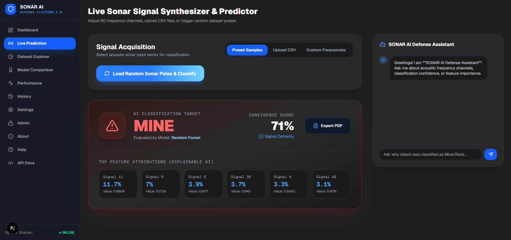

# 🪨 SONAR AI – Underwater Target Detection Platform 🚀

A modern AI-powered machine learning platform that classifies underwater objects as either **Rocks (R)** or **Mines (M)** using high-frequency sonar backscatter signal data.

> **Evolved from a basic ML notebook into an enterprise-grade full-stack 3D AI Platform**, combining real-time multi-model ensemble evaluation, explainable AI (SHAP attributions), interactive signal synthesis, and automated defense inspection report export.

---

## 📌 Project Overview

This project predicts whether an underwater object is a **Rock (R)** (natural seabed formation) or a **Mine (M)** (hazardous metal hull) using Machine Learning.

The prediction is evaluated across **60 sonar signal frequency features** representing acoustic energy reflection ratios ranging from `0.0` to `1.0`.

### Core Highlights:
- 🌌 **3D Cinematic Hero**: SpaceX/Apple Vision Pro inspired 3D ocean scene powered by Three.js & React Three Fiber.
- ⚡ **Interactive AI Dashboard**: Real-time 60-channel frequency synthesizer grid.
- 🎯 **Live Sonar Prediction**: Instant confidence gauge scoring with model selection.
- 📊 **Dataset Explorer**: Class balance distribution pie charts & mean backscatter profile line graphs.
- 🏆 **Model Benchmarking**: Multi-model comparison across 9 classification algorithms.
- 🔍 **Explainable AI (XAI)**: Feature attribution scores showing key signal channels driving predictions.
- 📄 **Defense PDF Export**: Downloadable official target inspection report.
- 💻 **Modern Architecture**: Next.js 15 Frontend + FastAPI Python ML Backend.

---

## ✨ Features

- 🎨 **Modern 3D-Inspired UI**: Built with a charcoal dark gray theme (`#1F1F1F`), electric blue glow accents (`#3B82F6`), and glassmorphism.
- 🖥️ **Interactive Dashboard**: Focused workspace revealing metrics without clutter.
- 🔮 **Live Sonar Prediction**: Real-time signal evaluation with instant certainty score.
- 📁 **Upload CSV Support**: Import custom `.csv` sonar files for batch or single predictions.
- 🎛️ **Manual Signal Input**: Adjust frequency sliders across 60 discrete acoustic channels.
- 🎲 **Random Sample Prediction**: One-click demonstration using stratified dataset records.
- 💯 **Confidence Score**: Radial gauge showing probabilistic model certainty.
- 📈 **Dataset Visualization**: Interactive Recharts components illustrating signal backscatter curves.
- 🏅 **Model Performance Dashboard**: Cross-validation metrics table with active model switching.
- 🧠 **Explainable AI**: SHAP-inspired top feature importances for operational transparency.
- 📜 **Prediction History**: Persistent SQLite audit logging for target evaluations.
- 📑 **Export Prediction Report**: Automated PDF generation complete with attributions & model metadata.
- 📱 **100% Mobile Responsive**: Seamless layout scaling across desktop, tablet, and mobile devices.

---

## 🤖 Machine Learning Models

The platform trains and evaluates **9 state-of-the-art Machine Learning algorithms**:

1. **Logistic Regression**: Linear baseline model for binary classification.
2. **Random Forest Classifier**: Ensemble of decision trees optimizing accuracy and feature importance.
3. **Decision Tree Classifier**: Interpretable tree-based decision logic.
4. **Support Vector Machine (SVM)**: Non-linear hyper-plane separation using Radial Basis Functions (RBF).
5. **K-Nearest Neighbors (KNN)**: Distance-based classification analyzing signal spatial proximity.
6. **Gradient Boosting Classifier**: Sequential boosting tree architecture for minimal residual loss.
7. **XGBoost Classifier**: Optimized distributed gradient boosting framework.
8. **LightGBM Classifier**: Fast leaf-wise gradient boosting optimized for numerical feature vectors.
9. **CatBoost Classifier**: Advanced categorical and numerical gradient boosting algorithm.

### Model Performance Metrics:
Users can compare models side-by-side based on **Accuracy**, **Precision**, **Recall**, **F1 Score**, and **ROC-AUC Score**. The platform automatically highlights and selects the top-performing winner model.

---

## 📊 Dataset

- **Dataset File**: `sonar_data.csv`
- **Total Samples**: 208 Instances (111 Mines, 97 Rocks)
- **Features**: 60 Numerical Columns (Acoustic energy ratios in range `0.0` - `1.0`)
- **Task Type**: Supervised Binary Classification
- **Target Label**:
  - **`R` = Rock** (Natural underwater structure)
  - **`M` = Mine** (Metallic cylindrical hazard)

*Note: The dataset represents sonar signals bounced off metal cylinders and rocks at various angles and frequencies.*

---

## 🔄 How the AI Works

```
┌─────────────────┐
│   User Input    │ (CSV Upload / Preset Sample / 60 Sliders)
└────────┬────────┘
         │
         ▼
┌─────────────────┐
│  Sonar Signal   │ (60 Frequency Channels)
└────────┬────────┘
         │
         ▼
┌─────────────────┐
│ Data Processing │ (Array Normalization & Reshaping)
└────────┬────────┘
         │
         ▼
┌─────────────────┐
│  ML Model (AI)  │ (Selected from 9 Ensemble Models)
└────────┬────────┘
         │
         ▼
┌─────────────────┐
│   Prediction    │ (Mine 🔴 vs Rock 🔵)
└────────┬────────┘
         │
         ▼
┌─────────────────┐
│Confidence Score │ (Probabilistic Certainty %)
└────────┬────────┘
         │
         ▼
┌─────────────────┐
│  XAI & PDF App  │ (Feature Importance & Report Generator)
└─────────────────┘
```

---

## 📥 Input Methods

1. **Preset Samples**: One-click random pulse selection from verified dataset records.
2. **Manual Input**: Custom fine-tuning of 60 individual frequency channels via interactive sliders.
3. **Upload CSV**: Direct file import of raw sonar datasets for batch classification.

---

## 📤 Output Information

Upon classification, the platform delivers:
- **Predicted Class**: `ROCK` or `MINE`
- **Confidence Score**: Probabilistic certainty percentage (e.g., `98.45%`)
- **Active Model Name**: Model architecture used for evaluation (e.g., `Random Forest`)
- **Top Attributions**: Key 6 frequency bands driving the prediction with percentage contribution
- **Export Option**: Downloadable official PDF report file

---

## 🛠️ Software Requirements

### Backend & Machine Learning:
- **Python**: `3.10+` / `3.11+`
- **FastAPI**: `0.100.0+`
- **Uvicorn**: `0.22.0+`
- **Pandas**: `2.0.0+`
- **NumPy**: `1.24.0+`
- **Scikit-learn**: `1.3.0+`
- **XGBoost**: `1.7.0+`
- **LightGBM**: `4.0.0+`
- **CatBoost**: `1.2+`
- **FPDF2**: `2.8.0+`

### Frontend UI Framework:
- **Next.js**: `15.0+` (App Router)
- **React**: `19.0+`
- **TypeScript**: `5.0+`
- **Tailwind CSS**: `v4.0`
- **Three.js / React Three Fiber / Drei**: 3D Ocean Canvas & Submarine
- **Framer Motion**: Smooth scroll & entrance animations
- **Recharts**: Data visualization & performance graphs
- **Lucide Icons**: Modern iconography

---

## 💻 Hardware Requirements (Current Version)

*This software project executes completely on standard host environments without physical hardware.*

| Requirement | Purpose | Recommendation |
| :--- | :--- | :--- |
| **Processor (CPU)** | Model training and FastAPI server | Quad-core Intel Core i5/AMD Ryzen 5 or higher |
| **RAM** | In-memory dataset & 3D canvas rendering | 8 GB RAM minimum (16 GB recommended) |
| **Storage** | Application codebase and ML dependencies | 2 GB available disk space |
| **Display** | High-resolution UI rendering | 1920x1080 resolution |
| **GPU** | Optional 3D canvas hardware acceleration | Integrated or Dedicated GPU |

---

## 🌐 Real-Time Embedded Hardware Vision

The platform architecture is designed to integrate seamlessly into physical autonomous underwater vehicles (AUV) and edge devices:

```
┌──────────────────┐      ┌─────────────────────────┐      ┌──────────────────────┐
│  Sonar Transducer│ ───► │ Raspberry Pi / Jetson   │ ───► │  SONAR AI Web Hub    │
│  (Ping360/Ping)  │      │ (Local FastAPI Model)   │      │  (Tactical Dashboard)│
└──────────────────┘      └─────────────────────────┘      └──────────────────────┘
```

### Hardware Components:

| Hardware Component | Purpose | Recommended Examples |
| :--- | :--- | :--- |
| **Sonar Sensor** | Emits acoustic pulses & captures backscatter frequencies | Blue Robotics Ping360, Ping Sonar, Ultrasonic Transducers |
| **Processing Unit** | Runs Python ML model locally on edge | NVIDIA Jetson Orin Nano, Raspberry Pi 5 |
| **Waterproof Enclosure** | Submersible housing for electronic sensors | IP68 Marine Sealed Acrylic/Aluminum Tube |
| **Power Supply** | Portable energy source for underwater deployment | LiPo 4S 14.8V Battery System |
| **Connectivity** | Telemetry data streaming to surface station | Tethered Ethernet / Subsea Acoustic Modem |

---

## 📂 Project Structure

```
Rock-vs-Mine-Prediction/
│
├── rock-vs-mine-ai/
│   ├── backend/
│   │   ├── main.py              # FastAPI Web Router & Endpoints
│   │   ├── model.py             # ML Engine, 9 Models & Stratified Trainer
│   │   ├── utils.py             # Defense PDF Report Generator
│   │   ├── requirements.txt     # Python ML Dependencies
│   │   └── sonar_ai.db          # SQLite Prediction History Database
│   │
│   ├── frontend/
│   │   ├── app/
│   │   │   ├── page.tsx         # Next.js Fullscreen Landing & Workspace Page
│   │   │   └── layout.tsx       # Root Next.js Layout
│   │   ├── components/
│   │   │   ├── 3d/
│   │   │   │   └── CinematicHeroCanvas.tsx # Three.js 3D Submarine & Sonar Radar
│   │   │   ├── dashboard/
│   │   │   │   ├── PredictionDashboard.tsx  # Live Frequency Synthesizer & Result Gauge
│   │   │   │   ├── DatasetExplorer.tsx      # Target Distribution & Signal Profile Charts
│   │   │   │   └── ModelComparison.tsx      # Multi-Model Benchmark Matrix
│   │   │   └── assistant/
│   │   │       └── AIAssistant.tsx          # Defense Chatbot Widget
│   │   └── package.json
│   │
│   └── dataset/
│       └── sonar_data.csv       # 60-Channel Sonar Signal Dataset
│
├── Rock_vs_Mine_Prediction.ipynb # Original Google Colab Exploration Notebook
├── sonar data.csv
└── README.md                    # Platform Documentation
```

---

## ⚡ Quickstart Setup

### 1. Clone Repository
```bash
git clone https://github.com/Sharathraj7/Rock-vs-Mine-Prediction.git
cd Rock-vs-Mine-Prediction/rock-vs-mine-ai
```

### 2. Start FastAPI Backend
```bash
cd backend
pip install -r requirements.txt
uvicorn main:app --reload --port 8000
```
*Backend runs at `http://127.0.0.1:8000`*

### 3. Start Next.js Frontend
Open a new terminal window:
```bash
cd rock-vs-mine-ai/frontend
npm install
npm run dev
```
*Frontend runs at `http://localhost:3000`*

---

## 🎯 Real-World Applications

- 🎖️ **Naval Defense**: Detection of submerged naval mines in tactical shipping lanes.
- 🚢 **Harbor Security**: Automated underwater perimeter surveillance.
- 🤖 **Autonomous Underwater Vehicles (AUVs)**: Edge AI object identification during ocean mapping.
- 🌊 **Marine Research**: Geological seabed rock classification and coral reef surveys.

---

## 📘 Original Notebook Learnings (Preserved)

- Data preprocessing & ingestion using **Pandas** and **NumPy**.
- Stratified dataset splitting via `train_test_split`.
- Initial baseline binary classification with **Logistic Regression**.
- Model validation using accuracy score and confusion matrices.
- Uploading local datasets into interactive Python environments.

---

## 📜 License

Distributed under the **MIT License**. See `LICENSE` for details.

---
*Built with precision for machine learning portfolio excellence.*
